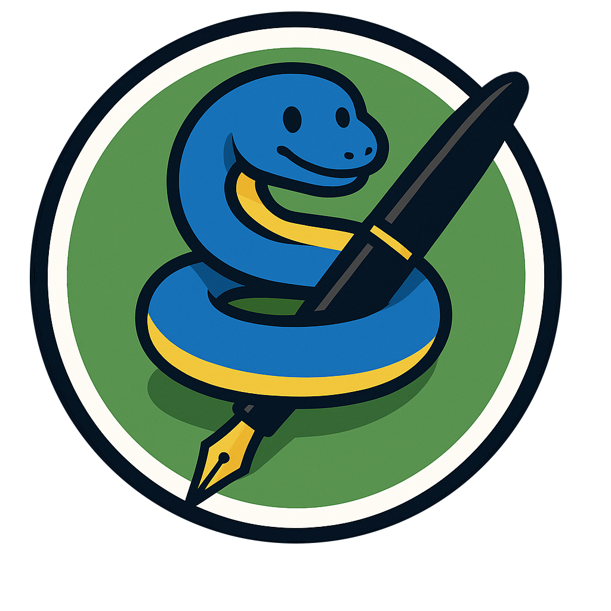
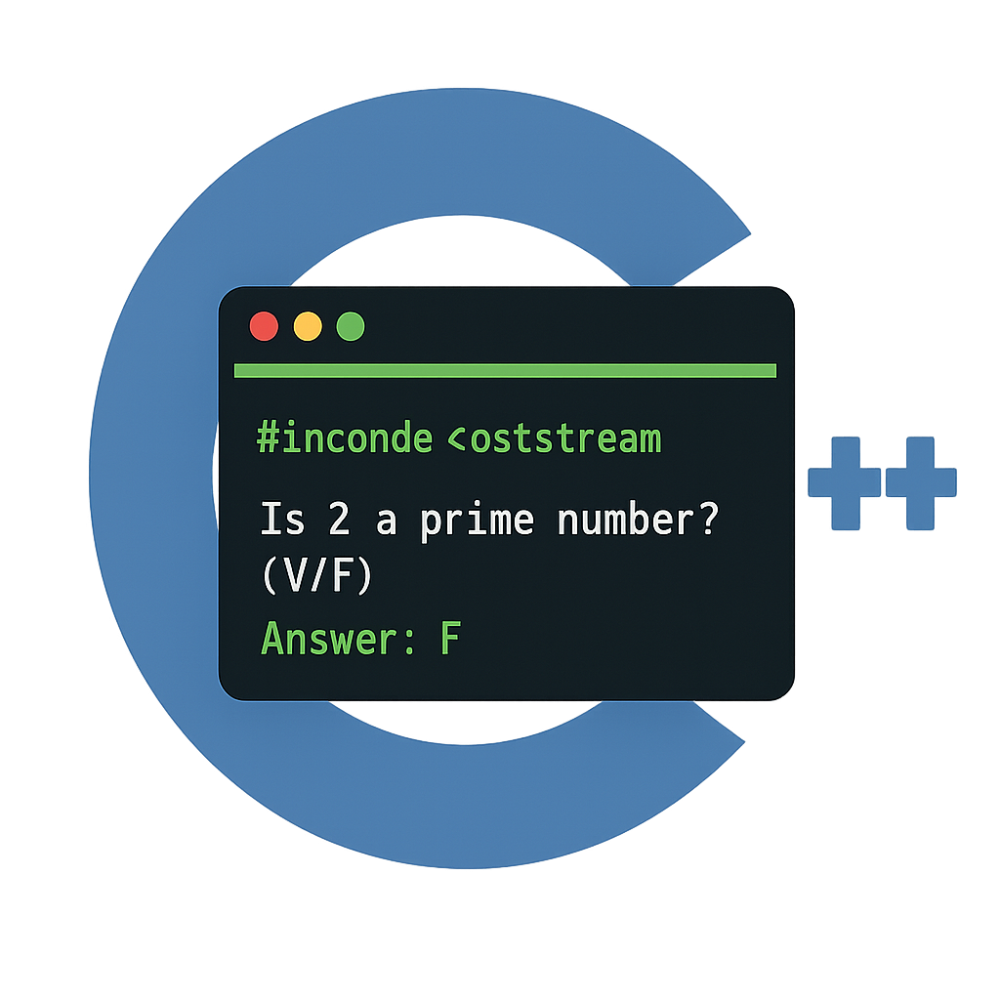

# Tester
El proyecto consta de dos partes:
<table align="center">
  <tr>
    <th><h2>Escriba.py</h2></th>
    <th><h2>Tester.exe/.sh</h2></th>
  </tr>
  <tr align="center">
    <td></td>
    <td></td>
  </tr>
  <tr align="center">
    <td>Se trata de un programa en python que <strong>extrae las preguntas de una imagen</strong>, y te aplica el formato necesario para que el <em>tester</em> lo entienda.</td>
    <td>Es un programa en C++ que toma como entrada un <strong>archivo con preguntas en .txt, y las muestra</strong> con un formato amigable en la terminal.</td>
  </tr>
</table>

# Modo de uso
<h2>
  
  Windows
</h2>

### ⬇️ Descarga
1. Descarga los programas de <a style="text-decoration: underline" href="https://github.com/cmc00150/Tester/releases/tag/v1.0.0">releases</a>.
2. Escoge **texter.exe** y **escriba-1.0.0-py3-none-any.whl**.
### 🏋️‍♂️ Preparación
1. El escriba.whl se puede extraer en tu entorno global de python, pero para tenerlo más organizado lo suyo es que creemos uno solo para él. De forma que luego sea mas facil de desinstalar si asi se quiera.
   <p></p>
   
   > 1. Creamos una carpeta donde vamos a tener el entorno de python: `mkdir carpeta_venv`.
   > 2. Nos metemos dentro de la carpeta para mayor comodidad: `cd carpeta_venv`.
   > 3. Creamos el entorno venv: `python3 -m venv nombre_del_entorno`.
   > 4. Dentro de la carpeta principal, se habrá creado otra con el nombre del venv. Para activarlo debemos llamar al **activate** dentro de esta: `nombre_del_entorno/Scritps/activate`.
2. Ahora para extraer el archivo wheel debemos poner: `pip install escriba-1.0.0-py3.whl`.
3. El ejecutable estará dentro de la carpeta `nombre_del_entorno/Scritps`.
4. Al pedirte una clave API, deberás cogerla del servicio de google: https://aistudio.google.com/prompts/new_chat. Donde pone `Get API key` (arriba a la derecha).
5. Pega la key, vuelve a iniciar el escriba y Voilà!!
> [!IMPORTANT] 
> Si se hace de forma global, al instalarse aparecerá: `WARNING: The script escriba.exe is installed in 'C:\Users\Asus\AppData\Local\Packages\PythonSoftwareFoundation.Python.3.13_qbz5n2kfra8p0\LocalCache\local-packages\Python313\Scripts' which is not on PATH`. Esto lo que te está diciendo es que el **escriba** se ha descargado en esa localizacion y que no es está en el PATH, por lo que si quieres usarlo en otro lado tienes que usar rutas. El ejecutable estará en esa carpeta __Scripts__.

<h2 style="display: flex; align-items: center; gap: 5px; ">
  
  Mac / 
  
  Linux
</h2>

### ⬇️ Descarga
1. Descarga los programas de <a style="text-decoration: underline" href="https://github.com/cmc00150/Tester/releases/tag/v1.0.0">releases</a>.
2. Escoge tanto **texter** como **escriba-1.0.0-py3-none-any.whl**.
### 🏋️‍♂️ Preparación
1. El escriba.whl se puede extraer en tu entorno global de python, pero para tenerlo más organizado lo suyo es que creemos uno solo para él. De forma que luego sea mas facil de desinstalar si asi se quiera.
   <a name="activar-venv"></a>
   
   > 1. Creamos una carpeta donde vamos a tener el entorno de python: `mkdir carpeta_venv`.
   > 2. Nos metemos dentro de la carpeta para mayor comodidad: `cd carpeta_venv`.
   > 3. Creamos el entorno venv: `python3 -m venv nombre_del_entorno`.
   > 4. Dentro de la carpeta principal, se habrá creado otra con el nombre del venv. Para activarlo debemos llamar al **activate** dentro de esta: `source nombre_del_entorno/bin/activate`.
2. Ahora para extraer el archivo wheel debemos poner: `pip install escriba-1.0.0-py3.whl`.
3. El ejecutable estará dentro de la carpeta `nombre_del_entorno/bin`.

# ✅ Ejecución
> [!IMPORTANT]
> Por como funciona linux, los archivos se descargaran sin permisos de ejecución. Por lo que para usarlos deberás darles permisos con `chmod u+x <nombre_programa>`. De esta forma solo tu tendrás permisos de ejecución.

> [!NOTE]
> En windows es lo mismo solo que le añade la extensión `.exe` a cada uno.
> ### Se recomienda el uso de _powershell_ en vez de cmd!!.
<h2></h2>

```
./escriba [-vf|-ab] [imagen1, imagen2, ...]
OPTIONS:
  -ab      Para que interprete la imgen como un archivo con preguntas de varias opciones.
  -vh      Para que interprete la imgen como un archivo con preguntas de verdadero o falso.
```

<h2></h2>

```
./tester [opciones] [flag](obligatorio) [directorio](obligatorio)
FLAGS:
  -vf             Para documentos de verdadero y falso.
  -ab             Para documentos de varias opciones.

OPCIONES:
  --random                Muestra las preguntas de forma aleatoria (default: forma ordenada).

  --time                  Establece un tiempo de delay entre pregunta y pregunta (default: 0), debe ser 0 o mayor que 0.

  --penalty               Establece cuantos fallos hay que tener para restar una buena (default: ninguna), debe ser mayor que 1.

  --history               Evita que se limpie la pantalla después de cada pregunta [true|false] (default: false).
```

> [!TIP]
> Puedes poner './nombre_programa' sin argumentos para ver las opciones en cualquier momento

# ⚠️ Eliminación
### Escriba
Con el entorno de venv activado: `pip uninstall escriba`.
### Tester
Simplemente se eliminaría borrando el .exe.
